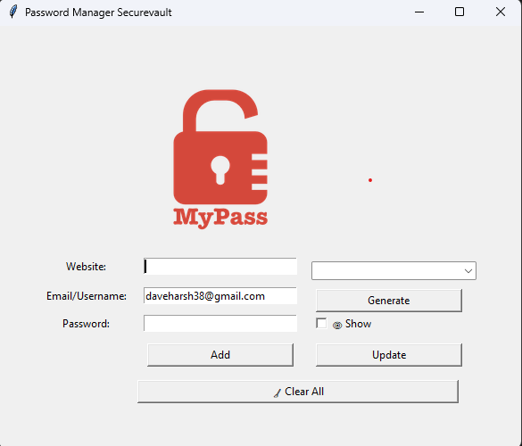
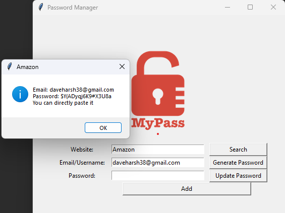
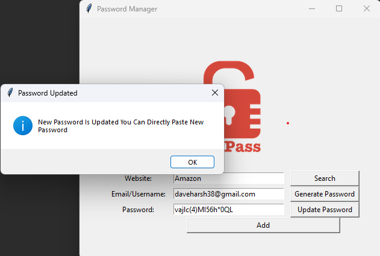
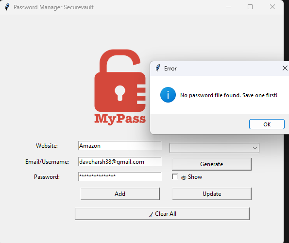

# 🔐 Encrypted Password Manager (Tkinter + Fernet)

A secure and intuitive **Password Manager** built using **Python**, with a focus on **backend logic, encryption**, and **real-world usability**. Originally inspired by the **100 Days of Code** course by **Dr. Angela Yu**, this project was initially a basic password manager with simple GUI and search-by-typing functionality.

I significantly improved the original version by adding:

✅ Dropdown-based search  
✅ Password **update** feature  
✅ Clear and **show/hide password** toggling  
✅ Full **encryption and decryption** using a securely generated key (Fernet)  
✅ Clipboard copy with timeout  
✅ Clean and interactive **Tkinter GUI**

---

## 🧰 Technologies Used

- Python 3.x  
- Tkinter (GUI)  
- `cryptography` (Fernet for symmetric encryption)  
- `pyperclip` (Clipboard interaction)  
- JSON (Storage)  

---

## 📸 Screenshots

Here’s a quick preview of the app in action:

### 🔐 Main Interface

### 🔍 Search Dropdown Feature

### 🔄 Update Password Popup

### 🔐 Error Popup

> 💡 Tip: Store your screenshots inside a `/screenshots` folder in the repo and use raw.githubusercontent.com links to embed them cleanly.

---

## 🚀 Features

- 🔒 **Encrypted password storage** using Fernet  
- 🔐 Show/Hide password toggle in the GUI  
- 🔎 **Dropdown-based search** for saved entries  
- ✏️ **Update existing** password credentials  
- ➕ Add new entries (Website, Email/Username, Password)  
- 🧹 Clear input fields after each entry  
- 🔑 Random password generator  
- 📋 **Clipboard copy** with auto-clear after 10 seconds  
- ✅ Validation alerts and popups for better UX  

---

## 🔒 Encryption Details

This app uses **Fernet** (symmetric encryption from the `cryptography` library):

- All passwords are stored in an **encrypted JSON file**
- A `key.key` file is generated once and used to encrypt/decrypt passwords
- If the key is lost or altered, the data becomes inaccessible

## 🧠 Future Improvements

- [ ] Add **master password** protection at launch  
- [ ] Implement **password strength indicator**  
- [ ] Enable **import/export** of encrypted backups  
- [ ] Add **dark mode** for GUI  
- [ ] Auto-lock after inactivity  
- [ ] Optional **biometric login** (platform-dependent)  
- [ ] Add **backup & restore** functionality  
## 👨‍💻 Author

**Dave Harsh Mukeshkumar**

- 🎯 Aspiring Backend Python Developer  
- 📧 Email: [daveharsh38@gmail.com](mailto:daveharsh38@gmail.com)  
- 🔗 LinkedIn: [Harsh Dave](https://www.linkedin.com/in/harsh-dave-391005233/)  
- 🐙 GitHub: [github.com/daveharsh38](https://github.com/daveharsh38)  

