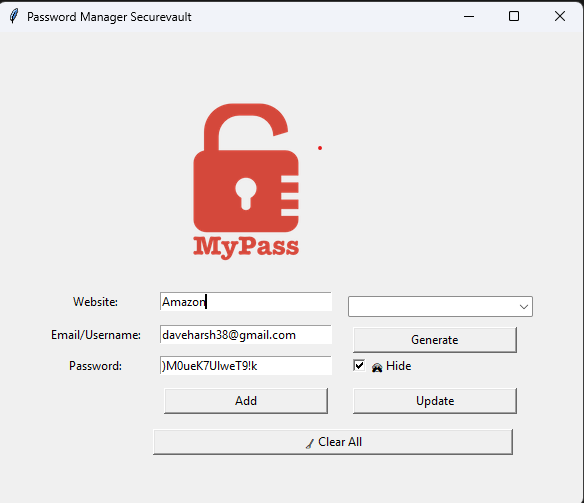
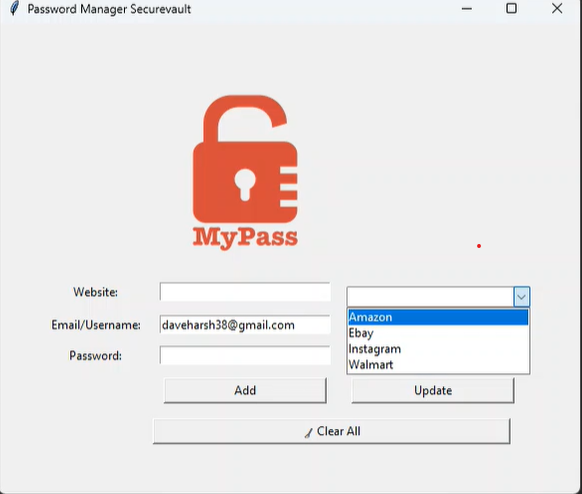
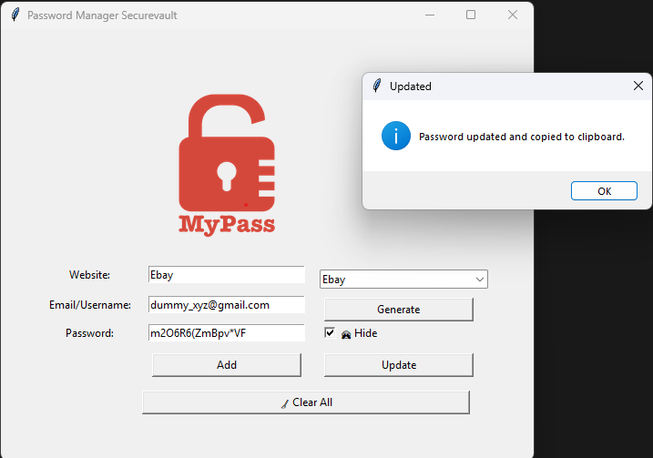

# :lock: Password Manager

## :pushpin: Overview
A powerful and efficient **local password manager** built using **Python and Tkinter**, designed for **secure password generation, storage, and retrieval**. This tool is ideal for individuals and professionals looking to **manage multiple accounts efficiently**. It offers a **user-friendly GUI**, **auto-copy functionality**, and **quick password search & update** features, ensuring a seamless experience. The project follows **best coding practices** and uses **JSON for secure local storage**. 

**Key Features Recruiters Look For:**
- **GUI Development using Tkinter**
- **File Handling & JSON Data Storage**
- **Clipboard Integration with Pyperclip**
- **Error Handling & User Notifications**
- **Secure Password Generation**
- **Software Deployment (Executable File Creation)**

## :rocket: Features
- :white_check_mark: **Generate Strong Passwords**
- :white_check_mark: **Save & Update Passwords**
- :white_check_mark: **Search for Stored Passwords**
- :white_check_mark: **Auto-copy Passwords to Clipboard**
- :white_check_mark: **Simple GUI with Tkinter**

## :camera: Screenshots
### Application UI


### Password Generation


### Searching Password


### Error


### Update Password


## :hammer_and_wrench: Installation & Setup
### :one: Install Required Dependencies
Ensure you have Python installed, then install dependencies using:
```bash
pip install pyperclip
```

### :two: Run the Application
```bash
python password_manager.py
```

## :computer: Technologies Used
- **Python** :snake:
- **Tkinter** :art: (for GUI)
- **JSON** :scroll: (for data storage)
- **Pyperclip** :clipboard: (for clipboard operations)

## :man_technologist: Author
- **Dave Harsh Mukeshkumar**  
- :email: Email: [daveharsh38@gmail.com](mailto:daveharsh38@gmail.com)  
- :link: [LinkedIn](https://www.linkedin.com/in/dave-harsh?lipi=urn%3Ali%3Apage%3Ad_flagship3_profile_view_base_contact_details%3BaE2YgdTmRyOOzb%2BjlCLvag%3D%3D)  
- :octocat: [GitHub](https://github.com/daveharsh38)

